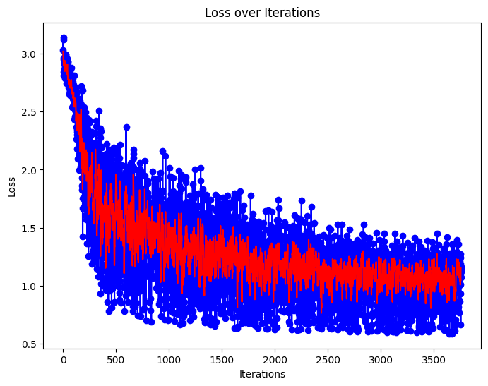
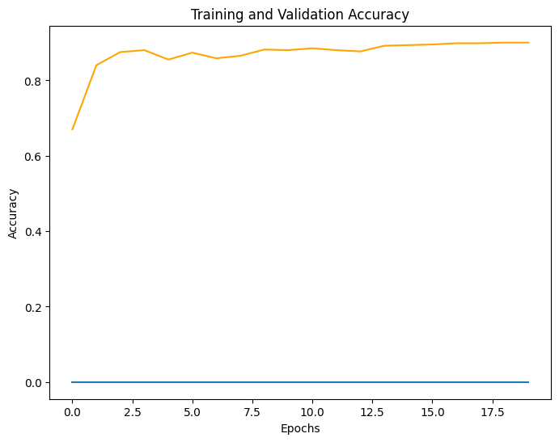
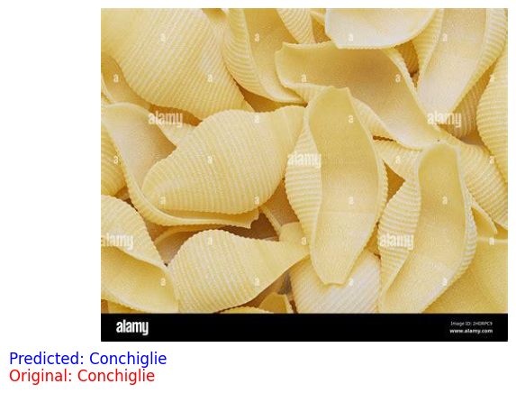
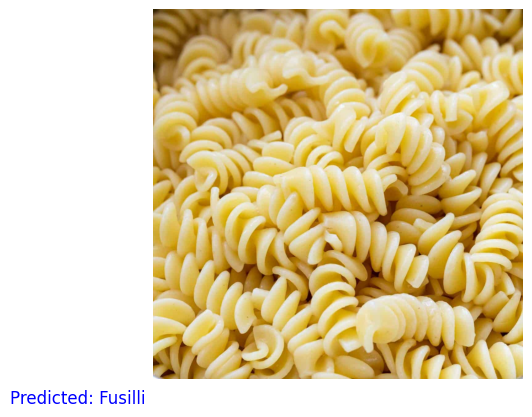
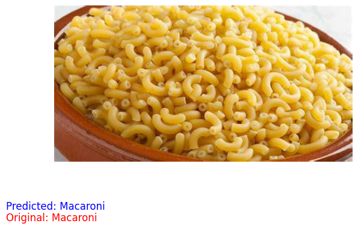

# Image classification Model for pasta noodles 

## The Model classifies the following categories
  1. Spaghetti
  2. Fettuccine
  3. Penne
  4. Rigatoni
  5. Macaroni
  6. Linguine
  7. Farfalle
  8. Tagliatelle
  9. Fusilli
  10. Orzo
  11. Conchiglie
  12. Bucatini
  13. Orecchiette
  14. Ravioli
  15. Tortellini
  16. Fregola

## Trained the Models on
  - Swin Transformer
  - MaxVIT
  - RegNet ✓
  - Efficient Net v2
  - ConvNext

## Loss && Accuracy

## Inference

